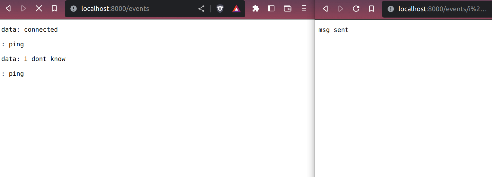

# Server Sent Events / SSE


## What is a Server-Sent Events?
It is a standard that enables the servers to send a stream of events to the subscribed clients.

## Why do we need SSE?
SSE helps to get real-time data from the server. 

Web sockets can do the same but they are bidirectional and the client can also send the data to the server. They can be overkill for the applications which need to send updates to the clients only. So we need SSE for that purpose.

## Some of the Uses Cases
- Twitter feeds
- Score Updates
- Stocks rates

## How does SSE works?
When a client requests, it forms an EventSource Object with the url of the server endpoint over the regular HTTP request. 

The server responds back with an event stream and keeps the connection until it feels that it has no events to send (or stable) or the client explicitly close the connection.


## How to implement SSE with actix-web?
Let's follow the easy steps:-

**Libraries required:-**
* [actix-web](https://actix.rs/):- A powerful, pragmatic, and extremely fast web framework for Rust
* [actix-web-lab](https://crates.io/crates/actix-web-lab):- Experimental extractors, middleware, and other extras for possible inclusion in Actix Web.
  
### 1. Setting Up Actix-web

#### Initializing the Rust Project
Start a new project with the following `cargo new <file-name>`.

#### Implementing basic actix server
Let's clone the sample code from [actix official docs](https://actix.rs/).

#### Add dependency in cargo.toml
```
....
[dependencies]
actix-web = "4"
#sse
actix-web-lab = "0.18.5"
parking_lot = "0.12.1"
futures-util = { version = "0.3.25", default-features = false, features = ["std"] }
....
```

#### Let's write code for actix server.

```
use actix_web::{web, App, HttpServer};

#[actix_web::main]
async fn main() -> std::io::Result<()> {
    HttpServer::new(|| {
        App::new()
            .route("/hello", web::get().to(|| async { "Hello World!" }))
    })
    .bind(("127.0.0.1", 8080))?
    .run()
    .await
}
```

#### Implementing SSE using actix-web-lab
**Broadcaster**  
- Initialise the client struct
    ```
    #[derive(Debug, Clone, Default)]
    struct BroadcasterInner {
        clients: Vec<sse::Sender>,
    }
    ```
  * The Debug trait is used for printing or debugging
  * The Clone trait let you clone the BroadcasterInner/ clients
  * Default trait lets you assign default value on initialisation

- Initialise the Broadcaster struct
  ```
    pub struct Broadcaster {
        inner: Mutex<BroadcasterInner>,
    }
  ```

  We have used the Mutex to mutate the value safely across the threads.

- Creating methods to implement ping, create a new instance, remove stale client, create new client, and broadcast message.
    * Create a new broadcaster instance
        ```
        impl Broadcaster {
            ....
            pub fn create() -> Arc<Self> {
                let this = Arc::new(Broadcaster {
                    inner: Mutex::new(BroadcasterInner::default()),
                });
                Broadcaster::spawn_ping(Arc::clone(&this));
                this
            }
            ....
        }
        ```

        This method will create a broadcaster instance which will ping the clients.

    * ping client
        ```
        fn spawn_ping(this: Arc<Self>) {
            actix_web::rt::spawn(async move {
                let mut interval = interval(Duration::from_secs(10));

                loop {
                    interval.tick().await;
                    this.remove_stale_clients().await;
                }
            });
        }
        ```
        This ping method is used to know the active clients and remove the stable ones. You can modify the logic as per your requirement.

    * Remove stale clients
        ```
        async fn remove_stale_clients(&self) {
            let clients = self.inner.lock().clients.clone();
            println!("active client {:?}",clients);

            let mut ok_clients = Vec::new();

            println!("okay active client {:?}",ok_clients);

            for client in clients {
                if client
                    .send(sse::Event::Comment("ping".into()))
                    .await
                    .is_ok()
                {
                    ok_clients.push(client.clone());
                }
            }

            self.inner.lock().clients = ok_clients;
        }
        ```
        This method will revalidate the client list and removes stale one.

    * Create a new client
        ```
        pub async fn new_client(&self) -> Sse<ChannelStream> {
            println!("starting creation");
            let (tx, rx) = sse::channel(10);

            tx.send(sse::Data::new("connected")).await.unwrap();
            println!("creating new clients success {:?}",tx);
            self.inner.lock().clients.push(tx);
            rx
        }
        ```

        sse::channel will create sender and receiver pair. The channel will take a buffer parameter which is the count of unsend messages stored without waiting.

        The first part -> sender can be cloned and shared across threads.

        The second part -> receiver is the regular event stream.

    * Broadcast new message
        ```
        pub async fn broadcast(&self, msg: &str) {
            let clients = self.inner.lock().clients.clone();

            let send_futures = clients
                .iter()
                .map(|client| client.send(sse::Data::new(msg)));

            // try to send to all clients, ignoring failures
            // disconnected clients will get swept up by `remove_stale_clients`
            let _ = future::join_all(send_futures).await;
        }
        ```

        It will broadcast messages to the active clients.

    * Complete Broadcaster
        ```
        use std::{sync::Arc, time::Duration};
        use actix_web::rt::time::interval;
        use actix_web_lab::sse::{self, ChannelStream, Sse};
        use futures_util::future;
        use parking_lot::Mutex;

        pub struct Broadcaster {
            inner: Mutex<BroadcasterInner>,
        }

        #[derive(Debug, Clone, Default)]
        struct BroadcasterInner {
            clients: Vec<sse::Sender>,
        }

        impl Broadcaster {
            /// Constructs new broadcaster and spawns ping loop.
            pub fn create() -> Arc<Self> {
                let this = Arc::new(Broadcaster {
                    inner: Mutex::new(BroadcasterInner::default()),
                });
                Broadcaster::spawn_ping(Arc::clone(&this));
                // println!("created success");

                this
            }

            /// Pings clients every 10 seconds to see if they are alive and remove them from the broadcast list if not.
            fn spawn_ping(this: Arc<Self>) {
                actix_web::rt::spawn(async move {
                    let mut interval = interval(Duration::from_secs(10));

                    loop {
                        interval.tick().await;
                        this.remove_stale_clients().await;
                    }
                });
            }

            /// Removes all non-responsive clients from broadcast list.
            async fn remove_stale_clients(&self) {
                let clients = self.inner.lock().clients.clone();
                println!("active client {:?}",clients);

                let mut ok_clients = Vec::new();

                println!("okay active client {:?}",ok_clients);

                for client in clients {
                    if client
                        .send(sse::Event::Comment("ping".into()))
                        .await
                        .is_ok()
                    {
                        ok_clients.push(client.clone());
                    }
                }

                self.inner.lock().clients = ok_clients;
            }

            /// Registers client with broadcaster, returning an SSE response body.
            pub async fn new_client(&self) -> Sse<ChannelStream> {
                println!("starting creation");
                let (tx, rx) = sse::channel(10);

                tx.send(sse::Data::new("connected")).await.unwrap();
                println!("creating new clients success {:?}",tx);
                self.inner.lock().clients.push(tx);
                rx
            }

            /// Broadcasts `msg` to all clients.
            pub async fn broadcast(&self, msg: &str) {
                let clients = self.inner.lock().clients.clone();

                let send_futures = clients
                    .iter()
                    .map(|client| client.send(sse::Data::new(msg)));

                // try to send to all clients, ignoring failures
                // disconnected clients will get swept up by `remove_stale_clients`
                let _ = future::join_all(send_futures).await;
            }
        }
        ```

- Creating a route for the sse stream and broadcast message
```
#[actix_web::main]
async fn main() -> std::io::Result<()> {
    let broadcaster = Broadcaster::create();

    HttpServer::new(move || {
        App::new()
            .app_data(web::Data::new(AppState {
                broadcaster: Arc::clone(&broadcaster)
            }))
            // This route is used to listen events/ sse events
            .route("/events{_:/?}", web::get().to(sse_client))
            // This route will create notification
            .route("/events/{msg}", web::get().to(broadcast_msg))
    })
    .bind(format!("{}:{}","127.0.0.1", "8000"))?
    .run()
    .await
}
```

- Let's implement the sse_client and broadcast_msg
    * sse_client
        ```
        pub async fn sse_client(state: web::Data<AppState>) -> impl Responder {
            state.broadcaster.new_client().await
        }

        ```

    * broadcast_msg
        ```
        pub async fn broadcast_msg(
            state: web::Data<AppState>,
            Path((msg,)): Path<(String,)>,
        ) -> impl Responder {
            state.broadcaster.broadcast(&msg).await;
            HttpResponse::Ok().body("msg sent")
        }
        ```
    * Complete [main.rs](./src/main.rs)
        ```
        use actix_web::HttpResponse;
        use actix_web::Responder;
        use actix_web::{web, App, HttpServer};
        mod broadcast;
        use self::broadcast::Broadcaster;
        use std::{io, sync::Arc};
        use actix_web_lab::extract::Path;

        pub struct  AppState{
            broadcaster:Arc<Broadcaster>
        }

        // SSE
        pub async fn sse_client(state: web::Data<AppState>) -> impl Responder {
            state.broadcaster.new_client().await
        }

        pub async fn broadcast_msg(
            state: web::Data<AppState>,
            Path((msg,)): Path<(String,)>,
        ) -> impl Responder {
            state.broadcaster.broadcast(&msg).await;
            HttpResponse::Ok().body("msg sent")
        }

        #[actix_web::main]
        async fn main() -> std::io::Result<()> {
            let broadcaster = Broadcaster::create();

            HttpServer::new(move || {
                App::new()
                    .app_data(web::Data::new(AppState {
                        broadcaster: Arc::clone(&broadcaster)
                    }))
                    // This route is used to listen to events/ sse events
                    .route("/events{_:/?}", web::get().to(sse_client))
                    // This route will create a notification
                    .route("/events/{msg}", web::get().to(broadcast_msg))
            })
            .bind(format!("{}:{}","127.0.0.1", "8000"))?
            .run()
            .await
        }
        ```

- Testing the SSE
  - Open the /events to subscribe to the event stream
  - Then hit the /events/<message> to send a message to the clients.


Hurray! we have finally implemented the Server-Sent Events.

Feel free to ask queries and make pull request for changes and suggestion in GitHub.

Happy Hacking
Rustaceans!